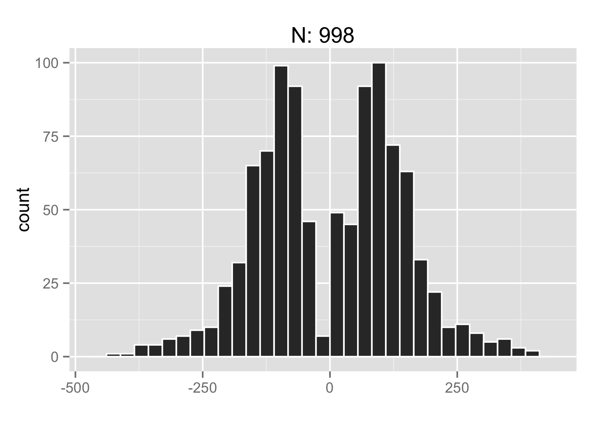
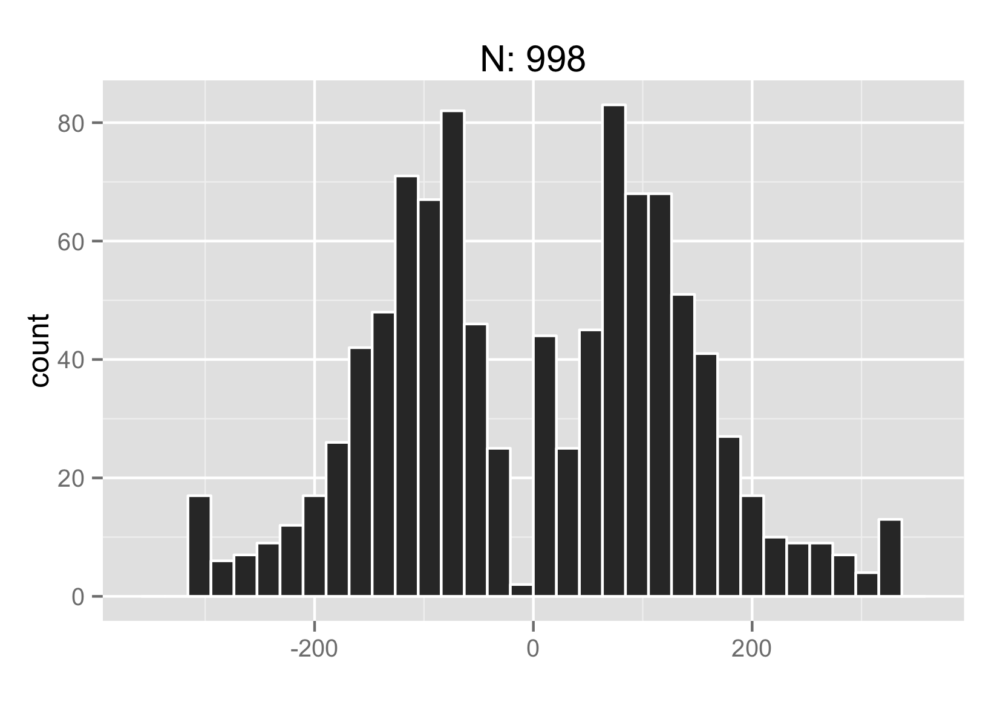
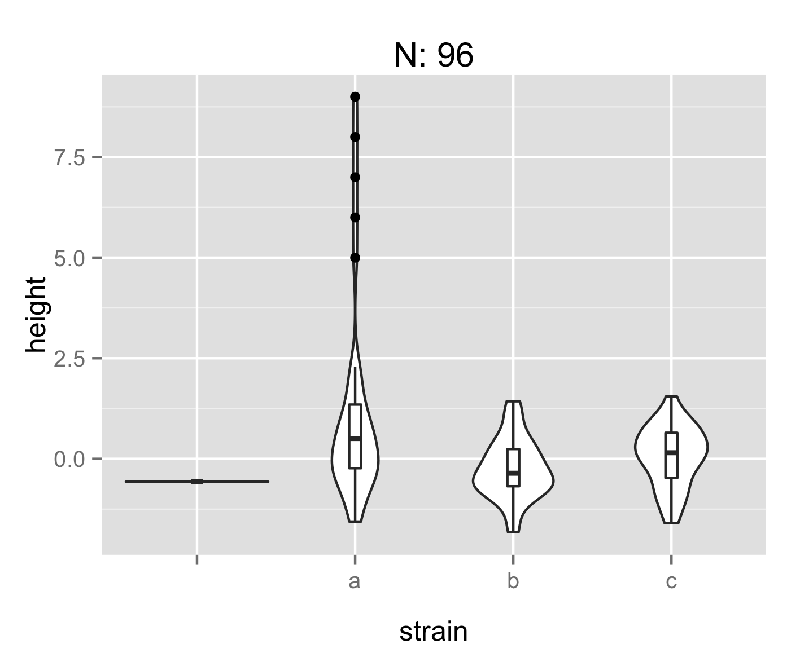
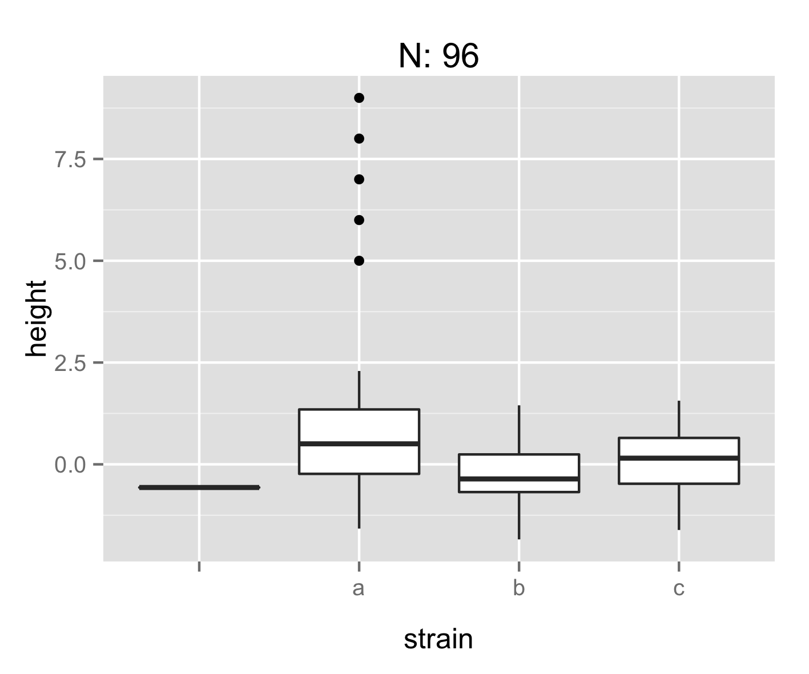
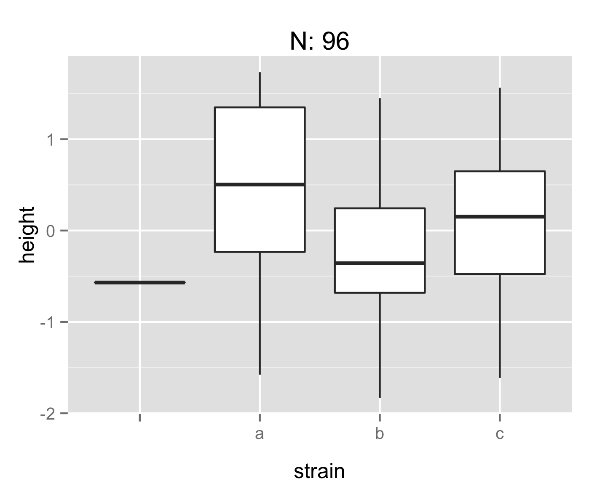
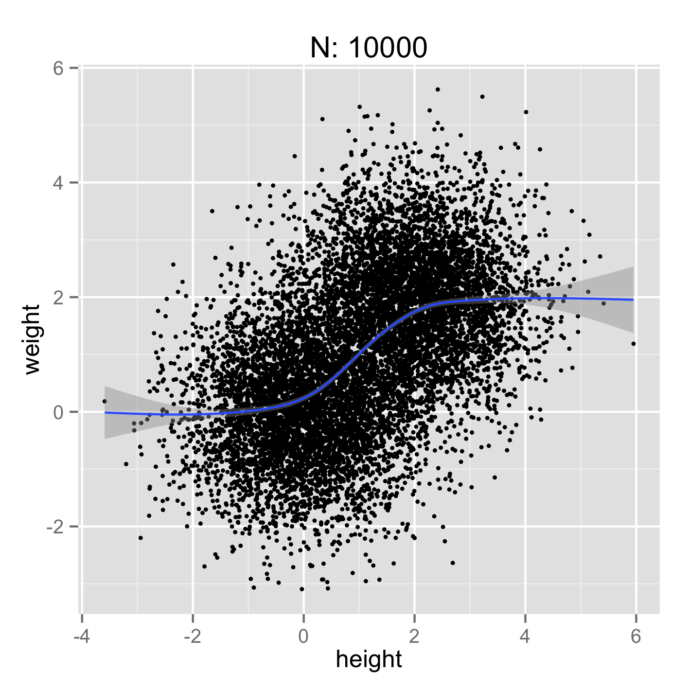
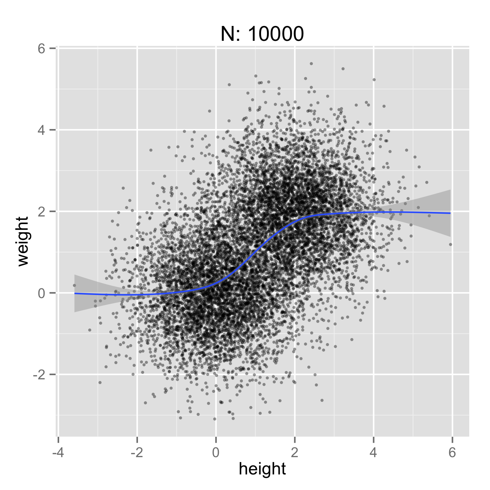
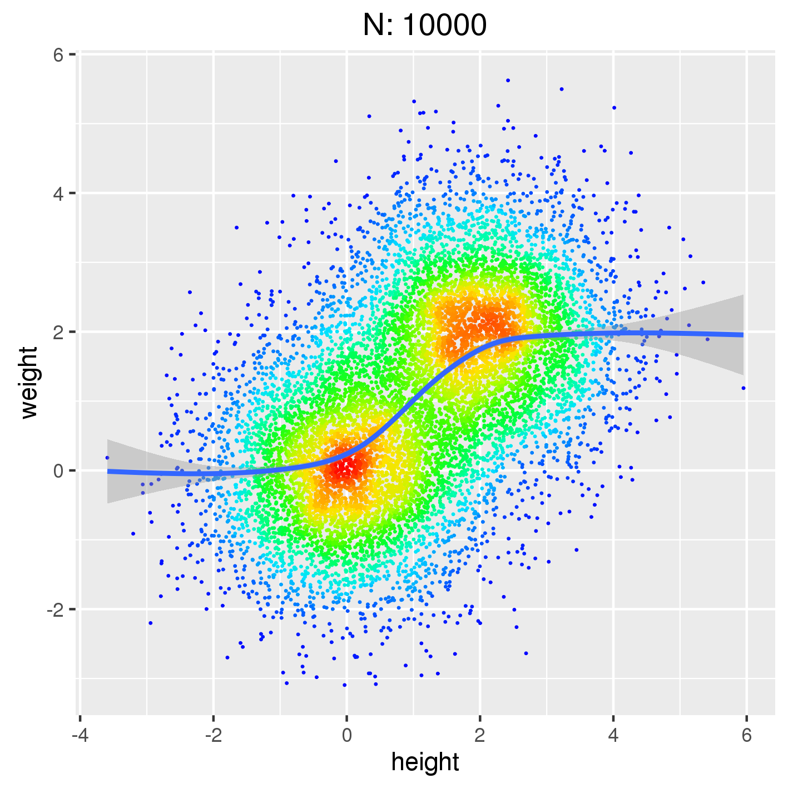

## A command line utility for quick data exploration

Pourpose: Produce various types of plots directly from command line in order to get a quick overview of the input data. There should be minimal need to tweak input data and plot parameters.
Plots are rendered using [R/ggplot](http://ggplot2.org/) but there's no need to know anything about R or ggplot.

Plot types

* **histogram** Histogram of numeric x values
* **xyplot** Scatter plot of numeric x and y values
* **boxplot** Box or violin plot of numeric y values in x categories
* **barplot** Barplot of numeric y values in x categories

## TOC

* [Examples and use cases](#examples-and-use-cases)
* [Installation and requirements](#installation-and-requirements)
* [Input and output](#input-and-output)
* [Handling skewed data](#handling-skewed-data)
* [Handling large dataset and performance](#handling-large-dataset-and-performance)
* [TODO](#todo)


### Examples and use cases

* What is the distribution of insert size in a bam file? Insert size is in column 9:

```
samtools view aln.bam | plot histogram -i - -x 9
```

To avoid reading in the entire file let's take every *N*th read:

```
samtools view aln.bam | awk 'NR % 1000 == 0' | plot histogram -i - -x 9
```

Winsorize long tails:

```
samtools view aln.bam | plot histogram -i - -x 9 -xwin 3
```

|||
:-------------------------:|:-------------------------:
  |  

* Distribution of data across categories: Box and Violin plots

```
plot boxplot -i data.txt -x strain -y height -bty violin
```



### Installation and requirements

Download and make `plot` executable, optionally move to dir on PATH:

```
wget https://raw.githubusercontent.com/dariober/bioinformatics-cafe/master/quickPlots/plot
chmod a+x plot
mv plot ~/bin/
```

Requirements:

* [R](https://cran.r-project.org/) and more specifically `Rscript` which should be already installed on *.nix systems.
* R package [ggplot2](http://ggplot2.org/). To install open up the R terminal and issue: `install.packages('ggplot2')`

### Input and output

`plot` reads directly from file or from from stdin. For example, to ignore lines containing `#` you could do:

```
grep -v '#' dat.txt | plot xyplot -i - -x 1 -y 2 ...
```

Lines containing non-numeric data when numeric data is expected (*e.g.* by `xyplot`) or incomplete
lines are silently discarded (this is intentional).

Data columns can be selected either by positional index or by name.
For example, to assign the first column to the **x** and the second to **y**:

```
plot xyplot -i dat.txt -x 1 -y 2 ...
```

Alternatively, columns can be selected by name:

```
plot xyplot -i dat.txt -x time -y weight ...
```

When selecting by name, the *first* line containing the required name(s) is located. Everything before the header line
is ignored and everything after is read as data.

Output is sent by default to the x11 window.
With option `-o` the plot is saved to file whose format is deteremined by extension (e.g. .png, .pdf, etc).
The size of the plot is set with options `-w <cm> -h <cm>`.

### Handling skewed data

Sometimes highly skewed data or outliers produce less informative plots.
With the options `-xwin` and `-ywin`, `plot` can [winsorise](https://en.wikipedia.org/wiki/Winsorising) data by limiting extreme values.
Alternatively, the parameter `-log` transforms the x and/or y axes to log10 scale.
These two plots have been produce with and without winsorisation:

|||
:----------:|:---------:
  |  

Another option might be to filter out outliers before passing data to `plot`. For example, to filter out values in column 1:

```
awk '$1 < 10' | plot histogram -i - -x 1 
```

### Handling large dataset and performance

`plot` reads in memory the entire input data, even columns that are not needed.
Although this is not very smart, the time and memory required should be more than acceptable even for large datasets.
Reading from files is particularly fast, less so reading from stdin, but still as fast as R would be, more or less. 
Plotting tens of millions of data points is usually not very useful anyway. Input data might be limited by reading the first n rows only
or by sampking every *N*th row as shown above.

If data points are clustered, you might choose to add some transparency or plot them as heatmap:

||||
:-------------------------:|:-------------------------:|:----|
  | | 

These three plots have been produced with (see also `figures/figures.sh`):

```
plot xyplot -i cloud.txt -x height -y weight -p 4 -d ',' -o xyplot-1.png -w 12 -h 12
plot xyplot -i cloud.txt -x height -y weight -p 4 -a 0.4 -d ',' -o xyplot-2.png -w 12 -h 12
plot xyplot -i cloud.txt -x height -y weight -t smooth -d ',' -o smooth.png -w 12 -h 12
```

## TODO

* Options to label axes `-xlab <lab> -ylab <lab>`?
