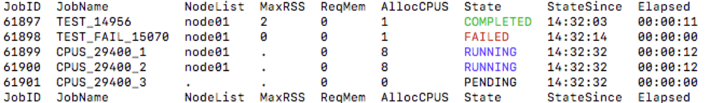

Job account viewer for the slurm job scheduler
----------------------------------------------

[Slurm](https://slurm.schedmd.com/) is a great job scheduler. However, the
facilities that come with it to monitor jobs, `sacct` and `squeue`, are not
very friendly. 

`xacct.py` is python wrapper around `sacct` that parses the output of `sacct`
to show the relevent information (at least for me...) in a friendly format.

Requirements
------------

* Python 3.x

* `sacct` on user's `PATH`

Installation
------------

Download, make executable and move to a directory on your `PATH` with

```
wget https://raw.githubusercontent.com/dariober/bioinformatics-cafe/master/xacct/xacct.py
chmod a+x xacct.py
mv xacct.py ~/bin/ # Or /usr/local/bin or wherever you like
```

Usage
-----

```
xacct.py -h      # show help
xacct.py         # Show today's jobs
xacct.py -d 1    # Show jobs from yesterday onwards
...
```

Example output



